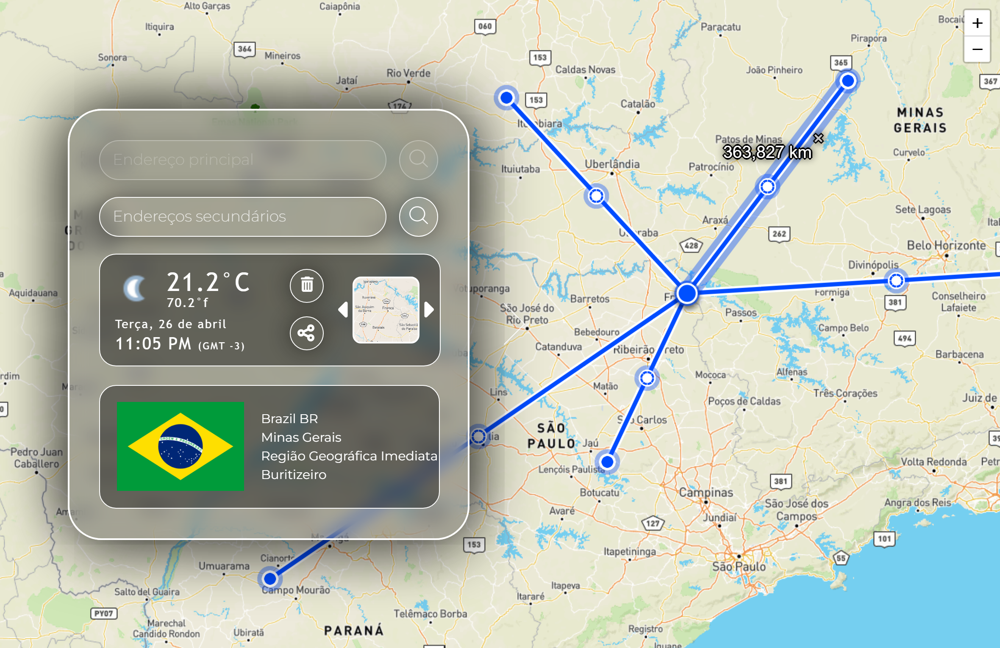
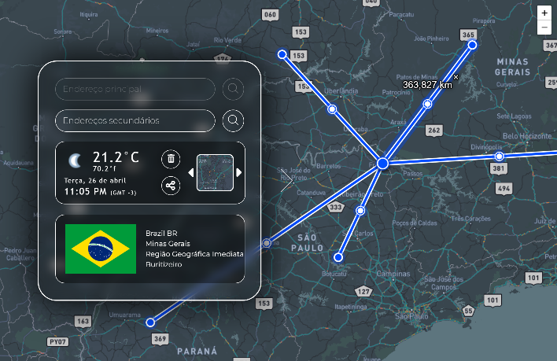
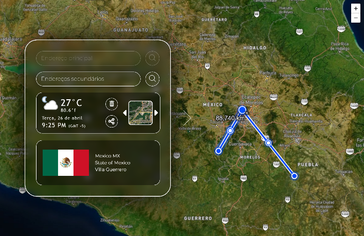

# Calculadora-Geografica
<h4>Aplicação para calcular a distância entre dois ou mais pontos do mundo apenas pelo seu endereço.</h4>

Utilize a barra de pesquisa correspondente ou clique no mapa para selecionar um endereço, a API irá buscar o local válido mais próximo. Após o processamento, selecione outros endereços para medir.

As distâncias serão calculadas a partir do endereço principal em linha reta.

A aplicação também conta com um pequeno painel com  clima, data, horário, e outras informações do local selecionado. 

- Para reiniciar, clique no ícone 🗑.

---

<h3> Personalização </h3>

No lado direito do painel superior, você pode selecionar 8 diferentes tipos de mapas, cada um com seu conjunto de imagens e estilos.

<i>Exemplo:</i>

⠀Dark⠀|Satellite
-----|-----
  |  

---

<h3> Tecnologias utilizadas </h3>
<ul>
<li>
<b><a href="https://leafletjs.com/" style="color: inherit; text-decoration:underline" target="_blank">Leaflet Lib</a></b>

Biblioteca base para a criação do mapa e interface interativa.

<a href="http://github.com/Leaflet/Leaflet" target="_blank">Github</a>
</li>

<li>
<b><a href="https://www.openstreetmap.org/" style="color: inherit; text-decoration:underline" target="_blank">OpenStreetMap</a> / 
<a href="https://nominatim.org/" style="color: inherit; text-decoration:underline" target="_blank">Nominatim API</a></b>

Tilesets e API para geolocalização e busca reversa de endereços.

<a href="https://github.com/openstreetmap" target="_blank">Github</a>
</li>

<li>
<b>
<a href="https://countryflagsapi.com/" style="color: inherit; text-decoration:underline" target="_blank">Country Flags API</a> /
<a href="https://timezoneapi.io/" style="color: inherit; text-decoration:underline" target="_blank">Timezone API</a> /

<a href="https://weatherapi.com/" style="color: inherit; text-decoration:underline" target="_blank">Weather API</a></b>

Detalhes adicionais para a interface de busca.

